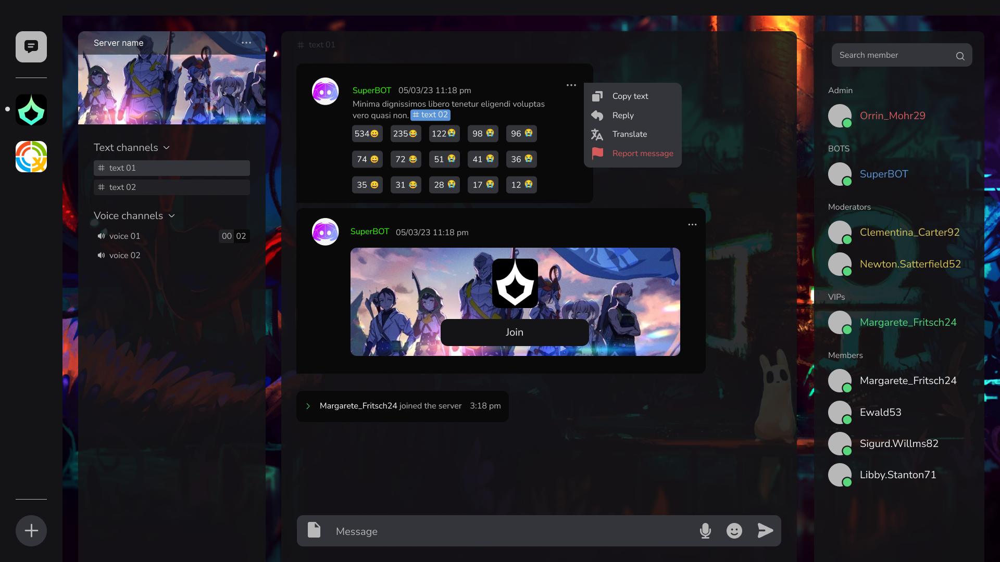

  

<h3 align="center">Ласкаво просимо до Lunaria</h3>

[English](README.md) | [日本語](README_ja.md) | [Українська](README_ua.md)

## Про Lunaria

Lunaria - це чат-додаток з відкритим вихідним кодом, побудований на основі протоколу QUIC, призначений для безпечного та ефективного спілкування.

 

## Особливості
- Підвищена безпека з протоколом QUIC
- Самостійний сервер
- Одноранговий зв'язок всередині VPN-мереж
- Широкі можливості кастомізації клієнта за допомогою скриптів Lua
- Функціональність CLI/чат-ботів на основі Lua

 

## Використані технології
У цьому проекті використовуються різні технології, зокрема:

- **Мови програмування**
  - [C++](https://en.cppreference.com/w/cpp)
  - [C](https://en.cppreference.com/w/c)
  - [Python](https://www.python.org/)
  - [Shell](https://www.gnu.org/software/bash/)
  - [Lua](https://www.lua.org/)

- **Бібліотеки/фреймворки**
  - [Qt](https://www.qt.io/) - фреймворк графічного інтерфейсу C++
  - [libpqxx](https://libpqxx.readthedocs.io/) - бібліотека C++ для PostgreSQL
  - [cassandra](https://opensource.docs.scylladb.com/stable/using-scylla/drivers/cql-drivers/scylla-cpp-driver.html) - C++ драйвер для ScyllaDB
  - [Protobuf](https://developers.google.com/protocol-buffers) - протокольні буфери
  - [NetBird](https://netbird.io/) -  VPN рішення
  - [MsQuic](https://github.com/microsoft/msquic) - Крос-платформна реалізація протоколу QUIC
  - [Abseil](https://abseil.io/docs/cpp/quickstart-cmake.html) - CЗагальна бібліотека C++ від Google, що пропонує необхідні компоненти для сучасної розробки на C++.
  - [OpenSSL](https://www.openssl.org/) - Oкриптографічна бібліотека з відкритим вихідним кодом, що реалізує протоколи SSL/TLS та надає криптографічні алгоритми.

- **База даних**
  - [PostgreSQL](https://www.postgresql.org/)

- **Інструменти**
  - [g++](https://gcc.gnu.org/) - компілятор
  - [CMake](https://cmake.org/) - система збірки
  - [Git](https://git-scm.com/) - керування версіями

 

## Підтримувані платформи
Lunaria підтримує:
- Linux (x11 | Wayland)
- Windows

 

## Підтримувані мови
Підтримка локалізації включає:
- Українська
- Японська
- Англійська

 

## Графічний інтерфейс

Ось кілька знімків графічного інтерфейсу користувача:

 

    
    &nbsp; &nbsp; &nbsp; &nbsp;
    

 

 

 

 

    
    &nbsp; &nbsp; &nbsp; &nbsp;
    

 
